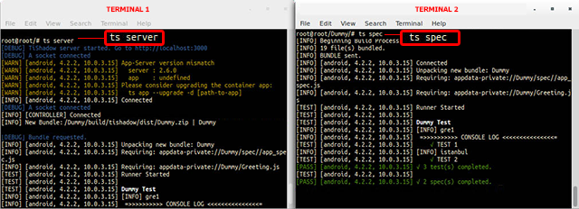
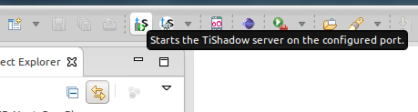
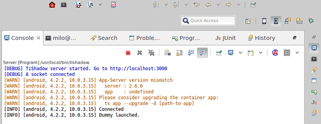
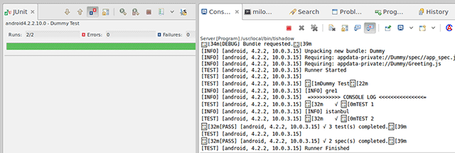

<!--toReplaceWithXML1-->

---

Web: <http://gzunino.github.io/tishadow-eclipse-plugin/>

TiShadow essentially works by building and installing a single app on iOS and Android.  This acts as a host or controller on the device.  That client app connects to your TiShadow server which pushes your Titanium project source code and resources out to the device and runs it as if it was compiled into the client app.

This plugin does a very good job on making the creation e installation as easy as possible to avoid using the OS terminals (consoles) at all. For instance, to run the TiShadow server and run the tests without using this plugin (, it is necessary to open 2 terminals. In this way, the user can use all the features the TiShadow provides in a transparent way.

Using all the capabilities Eclipse provides, like wizards, shortcuts, among others,  it is possible to create a TiShadow base application, appify an existing Titanium project and one of the best features: the abitily to run tests and see the reports on junit format.

---
# Installation Guide

## Adding URL repository

Point the following URL to your eclipse update site manager to install TiShadow Plugin:

Eclipse/Titanium Studio:

	http://gzunino.github.io/tishadow-eclipse-plugin/p2/

## Problems?

If you get an error installing similar to this:

	Cannot complete the install because one or more required items could not be found.
	Software being installed: TiShadow Feature 0.0.1.201401061758 (com.belatrixsf.tishadow.feature.feature.group 0.0.1.201401061758)
	Missing requirement: TiShadowTestView 0.0.1.201401061758 (com.belatrixsf.tishadow.tests 0.0.1.201401061758) requires 'bundle org.eclipse.jdt.junit 0.0.0' but it could not be found
	Cannot satisfy dependency:
    From: TiShadow Feature 0.0.1.201401061758 (com.belatrixsf.tishadow.feature.feature.group 0.0.1.201401061758)
    To: com.belatrixsf.tishadow.tests [0.0.1.201401061758]

This error during installation of the plugin is due it has some dependencies to JDT plugins, and you probably don't have the eclipse update site added/enabled to look for those dependencies.

You may try to add/enable the eclipse update site to your available software sites and then checking "Contact all updates sites during install..." in the Install Dialog.

Note: The update site URL will depend on you Eclipse/TitaniumStudio. For a standard TitaniumStudio 3.3 should be:

	http://download.eclipse.org/releases/kepler

---
# Running Tests with TiShadow

## Appify your project

First you have to "appify" the project you want to test, which will create a new app that is basically the same but with the TiShadow libraries included.

1. Go to <b>New>Project... TiShadow Appify Creation</b> (Or, right click on the project and then <b>New > TiShadow Appify</b>)
2. Enter the name of the appified project and select location of the  project you want to test (base project).
3. Select the location where the appified app will be created (output folder) if you don't want the default location.
4. Enter the port and host in which the TiShadow server will run.
5. Click Finish.

## Start the TiShadow server

Then, you need to start the TiShadow server in order to access its services.
So, just <b>click the run server button</b> on the TiShadow toolbar.

## Run the appified project

After that, you need to run the appified project on a device or emulator the same way you would run the original project.

Example: On Genymotion (emulator):

1. Open Genymotion.
2. Start your preferred device.
3. Start the appified project.

## Run the tests

Finally, to run the tests, you need to <b>right-click</b> on the original project, <b>not the appified one</b>, 
and then, <b> Run As > Run TiShadow Tests</b>.

---
# Changelog

_2014-06-30:_ TiShadow Appify option added to the right click menu, under 'New' (Only for Titanium projects).

_2014-07-03:_ Loading indicator added to the run tests functionality. Icons of the TiShadow Toolbar modified. 
	    Bug in which Titanium freezes after changing the Tishadow IP preference fixed.

_2014-07-04:_ A button was added to the JUnit perspective to re-run the last TiShadow test configuration.

_2014-07-07:_ A validation was added to run the tests only if there is at least one device connected to the 
	    TiShadow server.

_2014-07-08:_ A pulldown menu was added next to the Run TiShadow Tests button on the TiShadow Toolbar, which
	    allows to run any of the existing TiShadow Tests run configurations at any time.

_2014-07-10:_ A TiShadow help file was added to the help contents.

_2014-07-11:_ A Bug in which CPU usage increased considerably when running tests was fixed. Error messages
	    were corrected.

_2014-07-15:_ A progress indicator was added to the TiShadow Appify and App creation. A bug in wich an error
	    message was displayed indicating the lack of the ".project" file was fixed. An option to run the 
	    server was added to the 'Server not running' message.

_2014-07-29:_ Launch app option added to the 'no apps connected to the server' error message. A bug in which
	    the parameters field on run configurations wasn't being formed correctly was fixed. A bug about
	    the server button on the toolbar not being updated correctly was fixed.

_2014-07-31:_ A few bugs were fixed, that were related to problems when running tests on ti modules.

_2014-08-13:_ A CheatSheet page were added and help was updated.

---
# Authors and Contributors

* Guillermo Zunino
* Gerardo Fernandez
* Marcelo José
* Emiliano Hualpa
* Maximiliano Ambrosini
* Veronica Villegas

Contact: <a href="mailto:guillez@gmail.com">guillez@gmail.com</a>

<!--toReplaceWithXML2-->
