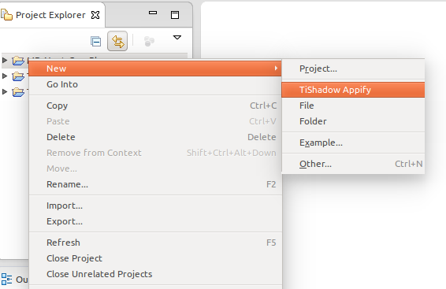

 

TiShadow Eclipse Plugin
=======================

Eclipse (Titanium Studio) Plugin to run TiShadow tests and display results on JUnit View

Installation instructions on <http://gzunino.github.io/tishadow-eclipse-plugin/> 

---

# Running Tests with TiShadow

## Appify your project

First you have to "appify" the project you want to test, which will create a new app that is basically the same but with the TiShadow libraries included.

1. Go to New.. TiShadow.. TiShadow Appify Creation (Or, right click on the project > New > TiShadow Appify)
2. Enter the name of the appified project and select location of the  project you want to test (base project).
3. Select the location where the appified app will be created (output folder) if you don't want the default location.
4. Enter the port and host in which the TiShadow server will run.
5. Click Finish.

   

## Start the TiShadow server

Then, you need to start the TiShadow server in order to access its services. So, do the following:

1. Click the run server button on the TiShadow toolbar; or, right click on the appified project that you just created, Run As, Run TiShadow Server.

  
    
## Run the appified project

After that, you need to run the appified project on a device or emulator the same way you would run the original project.

Example: On Genymotion (emulator):
1. Open Genymotion.
2. Start your preferred device.
3. Start the appified project.

## Run the tests

Finally, to run the tests, you need to do the following:

1. Right click on the original project, not the appified one, and then, Run As.. Run TiShadow Tests.

# Changelog
---
_2014-06-30:_ TiShadow Appify option added to the right click menu, under 'New' (Only for Titanium projects).

_2014-07-03:_ Loading indicator added to the run tests functionality. Icons of the TiShadow Toolbar modified. 
	    Bug in which Titanium freezes after changing the Tishadow IP preference fixed.

_2014-07-04:_ A button was added to the JUnit perspective to re-run the last TiShadow test configuration.

_2014-07-07:_ A validation was added to run the tests only if there is at least one device connected to the 
	    TiShadow server.

_2014-07-08:_ A pulldown menu was added next to the Run TiShadow Tests button on the TiShadow Toolbar, which
	    allows to run any of the existing TiShadow Tests run configurations at any time.

_2014-07-10:_ A TiShadow help file was added to the help contents.

_2014-07-11:_ A Bug in which CPU usage increased considerably when running tests was fixed. Error messages
	    were corrected.

_2014-07-15:_ A progress indicator was added to the TiShadow Appify and App creation. A bug in wich an error
	    message was displayed indicating the lack of the ".project" file was fixed. An option to run the 
	    server was added to the 'Server not running' message.

_2014-07-29:_ Launch app option added to the 'no apps connected to the server' error message. A bug in which
	    the parameters field on run configurations wasn't being formed correctly was fixed. A bug about
	    the server button on the toolbar not being updated correctly was fixed.

_2014-07-31:_ A few bugs were fixed, that were related to problems when running tests on ti modules.
